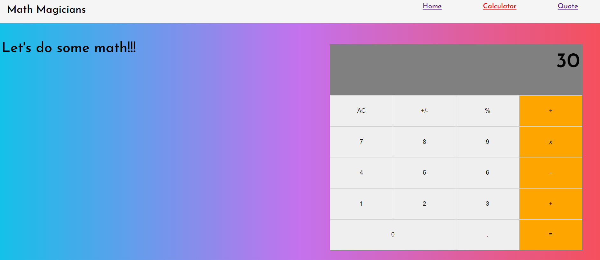
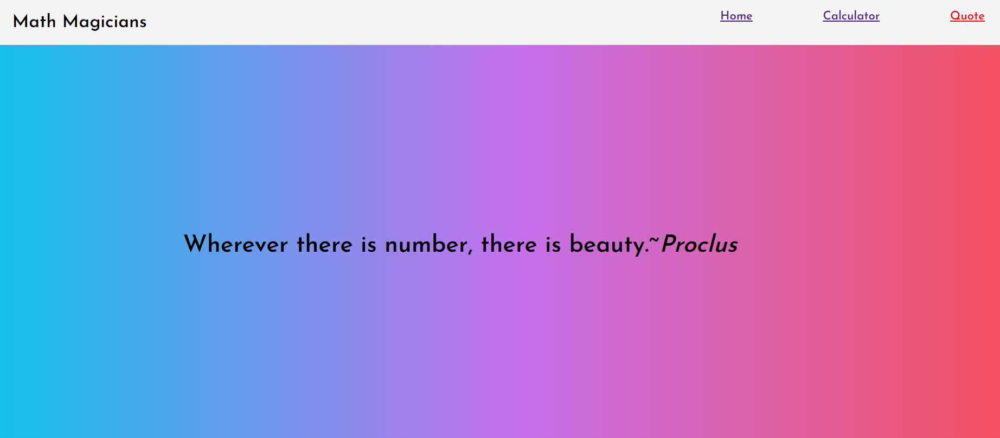

# Math Magician Application

> "Math magicians" is a website for all fans of mathematics. It is a Single Page App (SPA) that allows users to:

> - Make simple calculations.
> - Read a random math-related quote.

## Project screenshots





Additional description about the project and its features.

## Live Demo

[Live Demo Link](https://mosams.github.io/math_magician/)

[Live App Link (Heroku)](https://math-magician254.herokuapp.com/)

[Live App Link (Netlify)](https://math-magicians254.netlify.app/)

## Built With

- HTML
- CSS
- JAVASCRIPT
- REACT

### Using it Locally

- Clone the project from GitHub [here](https://github.com/Mosams/math_magician.git)
- Run the following commands as listed in your terminal:
- `npm install`
- `npm start`

## How to Setup

> You can simply clone or download [this repository](https://github.com/Mosams/math_magician.git), and use your favorite browser or code editor to run this program.

- To open the project after download, simply double click the index.html file

- To open this project using vs code ( for this example) or your favorite code editor, you can follow the guide below:
  > in your cmd or command line navigate to where this project is located, then;

```cmd
cd math_magician
```

> thereafter run

```cmd
code .
```

## Authors

👤 **Author**

- GitHub: [@githubhandle](https://github.com/Mosams/)
- Twitter: [@twitterhandle](https://twitter.com/sam_mongare)
- LinkedIn: [LinkedIn](https://www.linkedin.com/in/sammy-mongare-b8288310b/)

## 🤝 Contributing

Contributions, issues, and feature requests are welcome!

Feel free to check the [issues page](../../issues/).

## Show your support

Give a ⭐️ if you like this project!

## 📝 License

This project is [MIT](./MIT.md) licensed.
